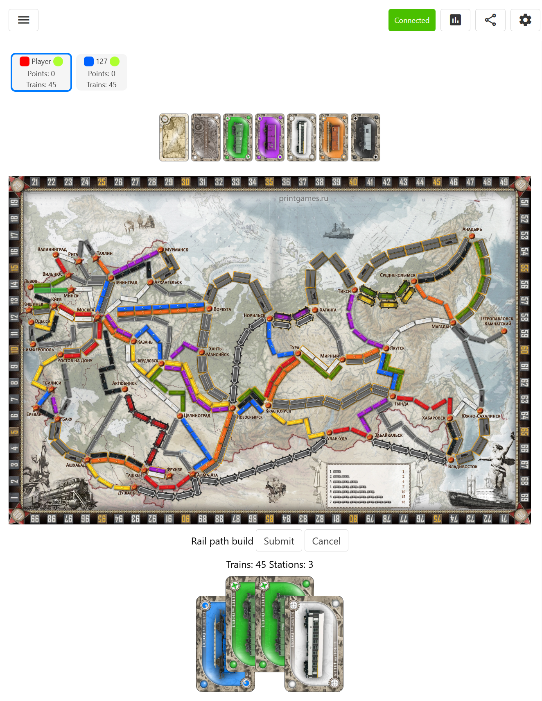

Ticket to Ride for [boardgame-web-ts](https://github.com/HMHamster88/boardgame-web-ts)



To build:

Download and build [boardgame-web-ts](https://github.com/HMHamster88/boardgame-web-ts)

Create .env file:

```
GAMES_MODULES_PATH='<Path to boardgame-web-ts data dir>\games-modules' (Default: '../boardgame-web-ts/back/dev-data/games-modules')
```

```
npm install
npm run link-common
npm run build-all
```